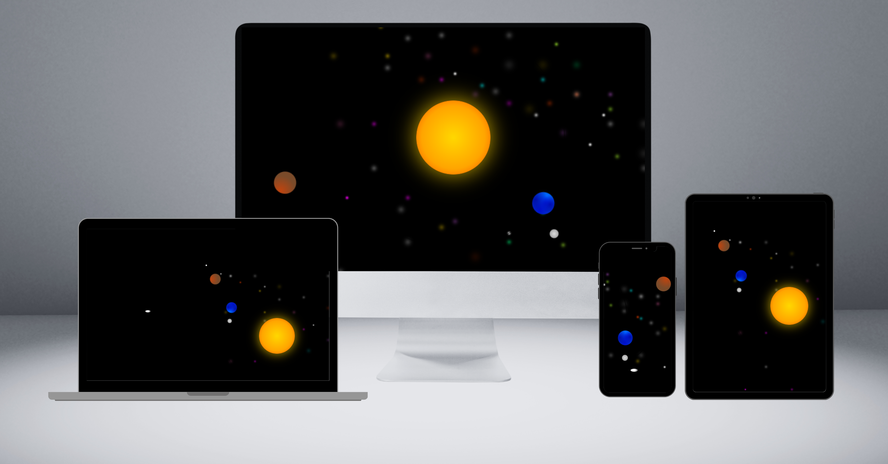

# ☀️🌍🌑 Sistema Solar 

Este projeto é uma representação básica e visual do nosso Sistema Solar e foi desenvolvido utilizando apenas HTML5 e CSS3, com o objetivo de apresentar corpos celestes como o Sol, a Terra, a Lua e um cometa em suas respectivas órbitas. O design é responsivo, adaptando-se a diferentes tamanhos de tela sem o uso de media queries. 
 
Além disso, cada animação e órbita foi feita com carinho para ser visualmente agradável e inspirar uma sensação de admiração e reflexão sobre a imensidão do espaço. As estrelas no projeto criam uma aparência de profundidade, convidando as pessoas a pensar sobre o universo e a refletir.
 
A astronomia sempre teve um lugar especial no meu coração, as estrelas e planetas despertaram minha curiosidade e me inspiraram a criar este projeto. 
  

## ⭐ Diferenciais do Projeto
1. **Animações Dinâmicas**  
   As animações simulam o movimento orbital dos planetas e outros corpos, proporcionando uma experiência visual contínua e fluida. O cometa adiciona um elemento dinâmico extra, movendo-se de maneira constante através do sistema.
   
2. **Responsividade sem Media Queries**  
   O projeto é responsivo de forma nativa, sem o uso de media queries. Isso é possível graças ao uso estratégico de unidades relativas (como vw, vh, e rem), que ajustam os tamanhos dos elementos de acordo com a tela. Todos os elementos do sistema solar, incluindo órbitas e corpos celestes, são dimensionados proporcionalmente, mantendo a integridade do layout em qualquer resolução, desde smartphones até monitores de grandes dimensões.

3. **Design Simples e Modular**  
   O código está organizado de forma clara e modular, permitindo fácil leitura e modificações futuras. 

## ☄️ Desafios Enfrentados
1. **Manter a Responsividade sem Media Queries**  
   A principal dificuldade foi garantir que o design permanecesse responsivo e funcional sem recorrer a media queries, ajustando dinamicamente todos os elementos com base nas unidades relativas. Ajustar a proporção dos corpos celestes e suas órbitas, de forma que mantivessem o alinhamento correto e esteticamente agradável em diferentes dispositivos.

2. **Animações Suaves e Precisão Visual**  
   Garantir que as animações fossem suaves e contínuas, sem afetar a experiência do usuário em diferentes resoluções. Evitar o overflow horizontal em telas pequenas, certificando que todos os elementos ficassem visíveis e corretamente posicionados.

## 🪐 Próximos Passos
- **Novos Corpos Celestes**: Adicionar mais planetas e luas ao sistema solar.
- **Interatividade**: Incorporar elementos interativos que permitam ao usuário explorar informações sobre cada corpo celeste.
- **Otimizações**: Melhorar a performance e o carregamento do projeto.

## 🔗 Contato
Para feedback, colaborações ou perguntas, você pode enviar uma mensagem no Linkedin ou enviar um email:
- <a href="https://www.linkedin.com/in/valdezjulian">Linkedin</a>
- Email: valdezjulian.tab@gmail.com

